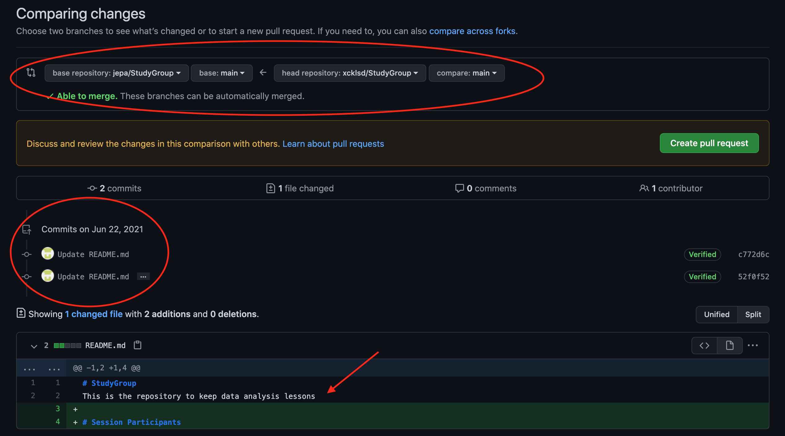
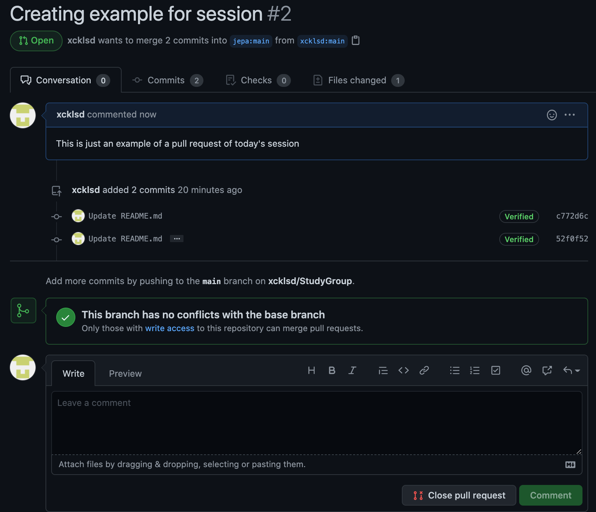
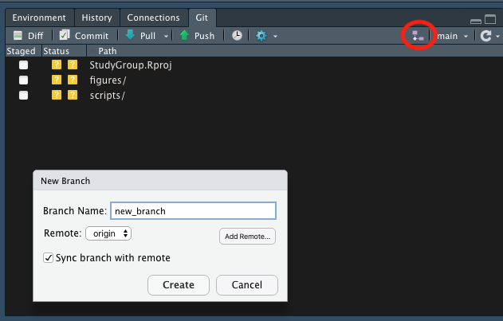
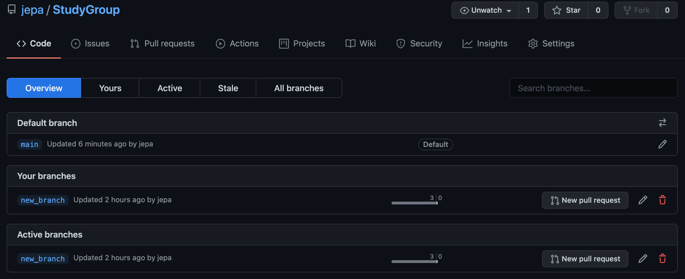
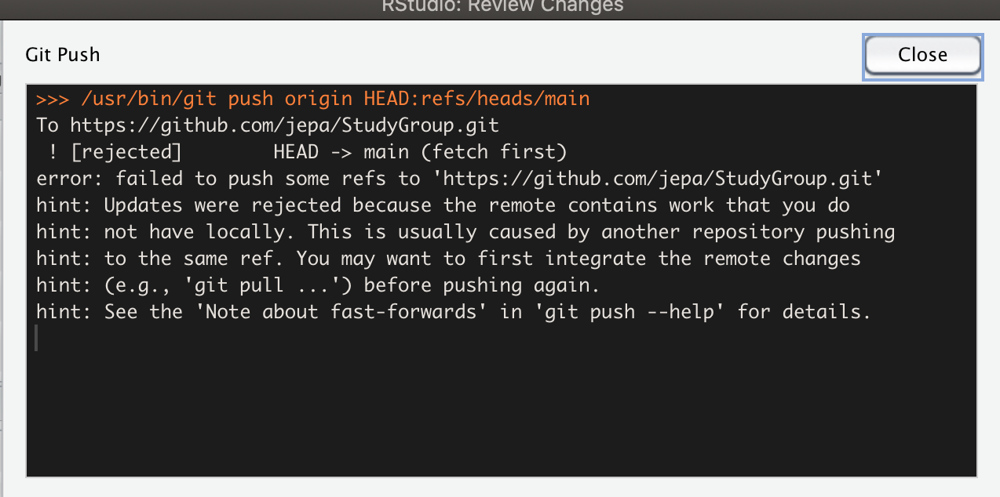
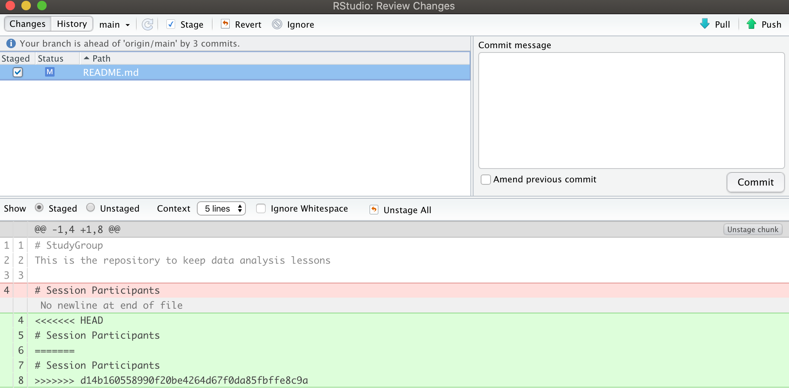
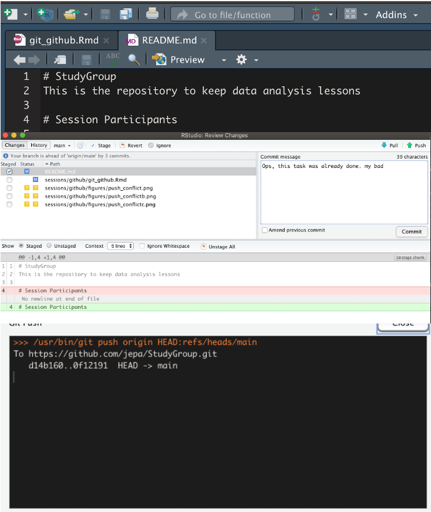

# Create a new repository

There are two (at least!) ways to create a new repository. You can choose the one you feel more comfortable about! Overall, you will have complete the following things:

- *Name*: you want it to be short and on point
- *Description*: allays good to have a brief description of what the repository is about
- *Local Path*: This is where you will save the repository in your computer
- *Initialize this repository with a README* Strongly recommended
- *Git Ignore*: This is a file that will allow you to exclude certain files from *sync*. Choose *R* if you're an R user
- *License*: It is always good to, at least, have one license, even if is open access work
- *Public or private*: If you pay or are a student, you can have private repositories.

**TASK:** Lets create a repository!

## **GitHub web page**

From this step you will create the repository from the GitHub web page. Go to GitHub and select the + sign in the top right, a sub menu will drop, just choose "New repository." After that just fill in the information and your repository will be created.

### Link the repository with R-Studio.

Once you create the repository you will have to link it to R-Studio so you can control your workflow. The way you create the repository will mark the way you connect. If you created the repository on the website, follow these steps to link it to R:

1.- Open R-Studio, go to "File" -> "New Project". Alternatively, on the top right Corner will say (should say) "Project (None)", the first option once you click should be "New Project...". A pop-pit window should appear. Go on and click on "Version Control" and then "Git". You should get to the third panel below.

2.- Once there, go to your repository home screen in the browser and click on the green button that says "Code". A pop up window should come out. Copy the "HTTPS" link (In the picture below, the link would be `https://github.com/jepa/StudyGroup.git`) 

3. - Go back to R-Studio and paste the link on the "Repository URL:" of your New Project Wizard window. The *Project directory name* will automatically show the name of your repo. (I suggest you keep the same). Finally, select the sub-directory in your computer where you will keep the repository. Click on "Create Project" and let the magic begin... 

## **GitHub Desktop.** 

This might be the most straight forward way to create a new repository from your computer. If you downloaded [gitHub Desktop](https://desktop.github.com/), go to `File` -> New Repository, a `Create a New Repository` window like the one below should pop out.

### Link the repository with R-Studio.

Now we go to R-Studio to link it to the new repository in one single step:

1.- Open R-Studio, go to "File" -> "New Project". Alternatively, on the top right Corner will say (should say) "Project (None)", the first option once you click should be "New Project...". A pop-pit window should appear. Go on and click on "Existing Directory" and then "Browse". Now, locate the Repository you created on the GitHub Desktop and that's it!

Regardless of the method you choose. Your R-Studio project should look something like this:

# Unig GitHub

## Solo mode

Technically speaking, GitHub was designed for collaborative work. However, I find it SUPER useful for solo work as well. Also, the more you work on it as a solo user, the more prepared you'll be for when you have to collaborate. In this section we will cover the basics of version control and some of hte *tools* GitHub has to offer such as *Issues*, *Branches*, and *web page*. 

### Commit, push, pull, repeat.

This is the base of version control. These steps are the responsible for saving your work flow, uploading it to the project repository and downloading it to your computer, i.e. sync. So, now that we have created our first repository we can start to work on it!

**TASK:** Lets create a file and push it!

Open an *R* script and write whatever you want on it.  Once we have made some changes to file and save them, you will see them reflected on your `Git` environment. Once we are done with this small task we should `Commit` our changes to our *local computer*. Remember to write a short but informative message!

Once we have done the Commits we want for the day we can push them to the Repo (a.k.a. merge them). Now go to your repository online and you will see your commit reflected in the projects page. 

## Collaborative mode, ON! 

So now that we know the basis, we can get into collaborative mode. For collaboration, the steps are basically the same with some few extra steps.

**TASK:** Lets all collaborate on the `StudyGroup` project.

### Forking!

First, when we are collaborating we need to `fork` the repository to our gitHub. Go to the web page of our StudyGroup (https://github.com/jepa/StudyGroup) and click on `Fork` on the top right. This will basically create our *own* version of the project. Note that my initial path says `jepa/StudyGroup`, this means that the repository belongs to the user "jepa", what does yours say? 

Now, let's practice and open the repository in your R-studio. Once you have it open, go to the README file and add your name under "Session Participants", commit and push your change. 

### Pull request commiting

Once we are done with our work, we want to merge it with the project's main branch so all of your collaborators can see what you did. On the github web page we can see that the README file for our repository now has our name. Go head and click on `Pull request` and the green button `New pull request`. You should see the following window;

In the top we see the branch we are working on and the branch we want to merge with. It should also say "Able to merge" in green. In the middle panel it shows what files you have modified (in this case the `README`file should show up) and in the bottom the actual modification.

Now that we are sure this is what we want we click on "Create a Pull request". The next window will show us a summary of the pull request. Note that it opens like a "chat" mode where users can comment, accept or reject the request.

### Merging 

Now, because I am the only *owner* of the repository, I am the only one with the power of *accepting* you `Pull Request`. Note that the repository now shows "1" `Pull request` and when I open it, I get to a similar page than you. The main difference is that I can `Merge pull request`.   

## gitHub tools and best practices

### The README file.

The `README.md` files are one of the most useful tools of GitHub. These files are shown directly in the repository and can work as a guidance to your repo. Let's take a moment to write our `README.md`. Here are some examples; [This Repo](https://github.com/jepa/StudyGroup), [FishForVisa](https://github.com/jepa/FishForVisa), [OHI-Science](https://github.com/OHI-Science/data-science-training).

**TASK:** Take some time to populate our `README.md` file. Remember, every time you make a change to the repository you will need to "Commit" that change

### Issues

How many of you have comment on your code things like `# Change this value when new data arrive"` and then completely forgot about it? Well, the *Issues* tab is here for you! Basically, we document all the issues we find in our code, and weather or not we have dealt with them. Issues become a key aspect of collaborative projects and the exchange between collaborators stays there.

#### Setting an Issues template

I like to have a standardized way of presenting issues. For that, go to the *Insights* tab, select *Community* on the left-side menu, and click on `Add` *Issues templates*. Depends on what the repository is, you can choose from some options. For my personal projects I just use a modification of the `Bug template`. 

**TASK:** Create an Issue template for your repository

#### Create a New Issue

Go to the *Issues* tab and click on the green button "New issue". Some things in the issue:

- **Assignees**: When collaborating, you can assign specific colaborators to specific issues. 
- **Labels**: A nice way to keep track of similar issues (e.g., coding, data, function)

**TASK:** Create an Issue with a Label. Respond to that issue and close it. 

### Branches

Branches are a way you can explore parts of your project without altering the main product. Think about it this way. 

Lets imagine you just finished all of your paper's analysis in the `master` branch (all projects start on this branch). Analysis, results, figures, everything is nicely done. You send the paper to your co-authors and one of them asks you what would happen if, instead of averaging your results by 10 years you average them by 20 years. A relative big task that will take you some time to compute. 

In the heat of the moment you forget about branches, go to your analysis script, and comment out some parts of your code, change parts of the code, change your plots, axis, and all the shenanigans. You get the final results and present it to the co-authors. Guess what, the co-author decided that the original analysis was fine. 

At this point you made sooooooo many changes in the analysis script that it takes you a week to figure out where you were in the original analysis. Also, you can't really just go back on the version control because you made substantial changes to the manuscript in parallel and you would loose those, oh my!

On a parallel universe, you created a new branch called `time_test` to work on this request. In this universe your co-author and you decided that this is a better approach. In this case you do a `Pulll Request` and eventually *merge* the `time_test` branch to the `master`. Now, your `master` branch includes the analysis script of the `time_test` and the changes to your manuscript file are not lost. 

#### New branch

To create a new branch you have two options. In R-Studio go to the `Git` tab and click on that "purple funny icon". A pop-out window will appear, just type in the new branch name and that's it. Note that the project will immediately switch to work on that branch. 

**Note**: R-Studio will always display the name of the branch you are working on right next to the funny-looking icon. To switch between branches you simple need to click the name and choose the one you want to work on. Allways comit your work before switching branches. 

#### Merge Branch

If you are ready to make the documents worked on the alternative branch the main ones of your project you need to merge the alternative branch to the main one. Merging branches are a two way steps, i) there is a pull request and a ii) merge confirmation.

##### Pull request branch

You can see how many branches you have in the github.com page of your project. Also, github will create an alert message when someone (you or a collaborator) pushes some work on an alternative branch.

You can just click on "Compare & pull request", or, on `branches` where you will see all the active branches, the commits that each one has, and a button that says "New pull request" (I you click in the name of the branch, it will take you to the project within that branch).

Once in the pull request section, you will need to write a title for the pull request, a description and submit the pull request. Github will automatically look for merging issues (e.g., if there are multiple versions of the same document worked at the same time in the same parts) and if it's all good you will have "requested a merge".

##### Merging branch

For the branch to be merged, someone has to click on `Merge pull request`, write a comment and accept the merge. Once that's done, you can erase the branch by clicking on the trashcan icon. If you choose not to merge a red button will pop out and a "Delete branch" too. At the end, you will have a documented, version control of your pull requests.

**TASK:** Crete a new branch do some alterations to an existing document and merge that branch to the main.

### Project web page

GitHub has a cool option that allows you to have an `rmarkdown`-based web-page for your project. The best part of it is that with a couple of clicks, you get a nice template!

**TASK:** Get a web page for our project

Go to the repository you created (not `StudyGroup`) main page. Go to *Settings* and click on *Pages* on the left menu (the last one). Under `Source` select "main". You will be presented with two options:

- `root`, this option is the most basic one and will use the `README` file as the web page basis.

- `docs`, this option will create a web page on a folder named `docs`. You will need to create the folder first.

## Best practices

Note that this is a list mainly reflecting the suggestions from [GitLab](https://about.gitlab.com/topics/version-control/version-control-best-practices/).

- Make incremental, small changes
- Keep commits atomic
- Develop using branches
- Write descriptive commit messages
- Obtain feedback through code reviews
- Identify a branching strategy

# The pull conflict... 

At some point we will all have that one conflict of merging that can quickly become a nightmare...This is normally the case when you **FORGOT** to `pull` *before* starting working on a document someone else already worked.

Step one: DO-NOT-FREAK-OUT. Looks horrible and full of words like *remote work*... *fast-forwards*... etc. But the truth is, once you figure it out is not *that* bad. GitHub has a way to tell you were the matching versions are. Once you close the window, click on the orange document(s).

In this case, looks like I also changed the `README` file and created a conflict while showing the collaborative example. This will also reflect on my `README.md` file.

This is an easy case so I can just erase one of the repeated lines, fix the issue, `commit` and then `push` the repo.

